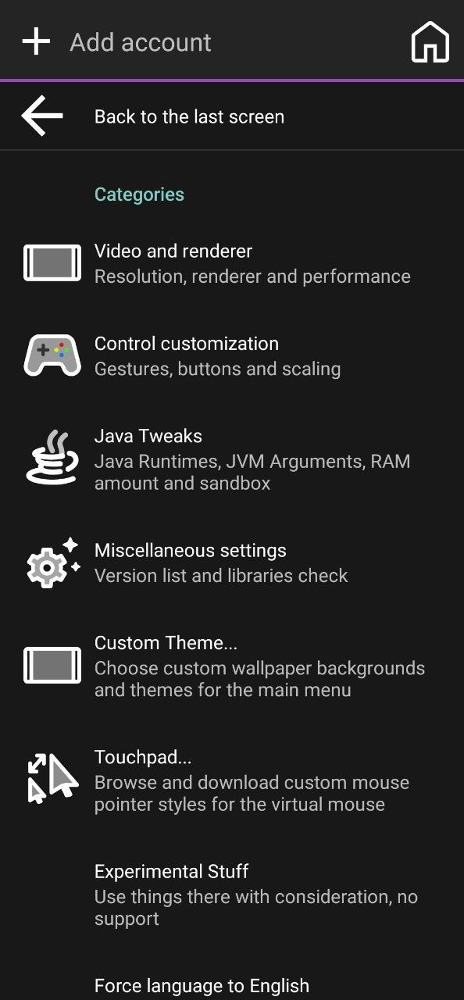
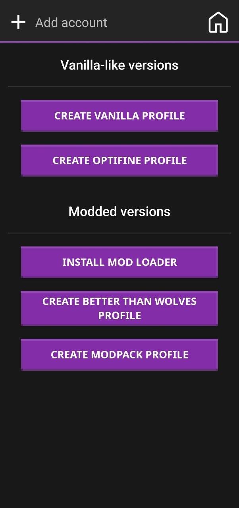
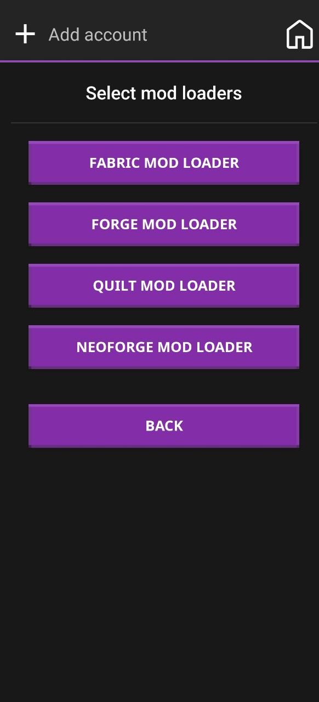
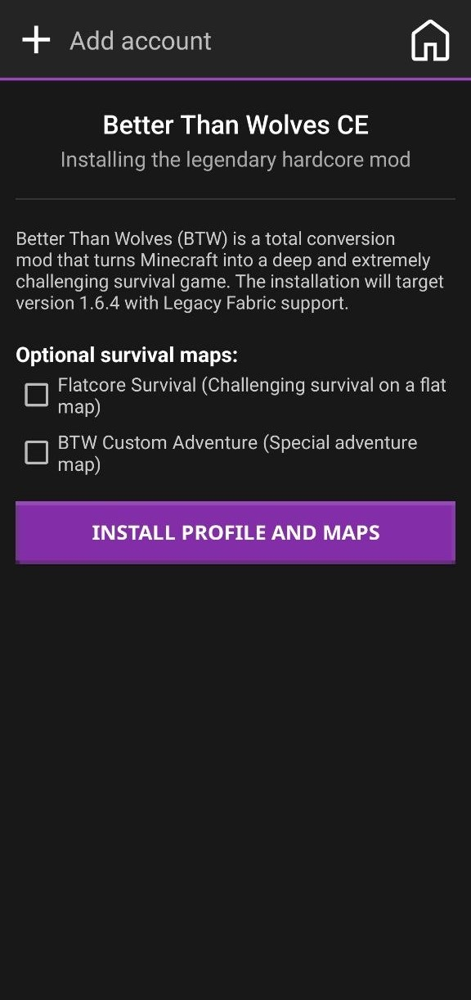
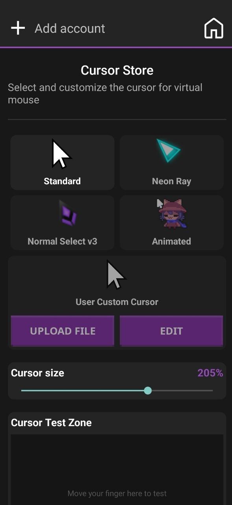
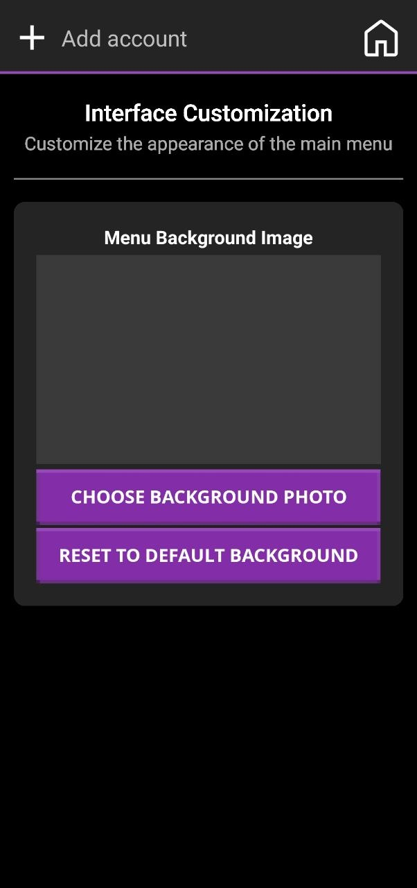
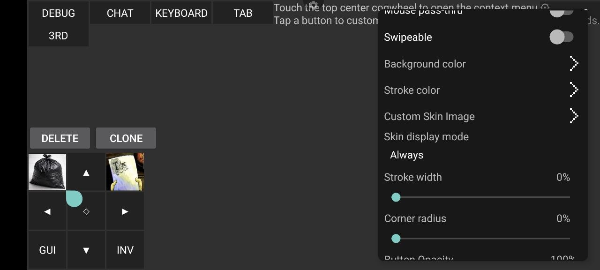
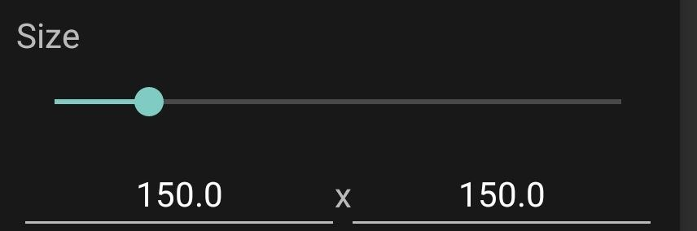

<p align="center">
  
</p>

# XDAetherium Android

<p align="center">
  <a href="README.md">English</a> | <a href="README_RU.md">Русский</a>
</p>

**XDAetherium** is an Android launcher for running **Minecraft: Java Edition** on phones and tablets. It is based on Amethyst/PojavLauncher/Boardwalk and includes custom changes for a smaller APK, Ely.by accounts, working Ely.by skins, custom branding, and Android Java runtime fixes.

> This project is not affiliated with Mojang, Microsoft, or Ely.by. Use your own account and follow the rules of the corresponding services.

## Features

- Run Minecraft: Java Edition on Android.
- Microsoft account support from the upstream launcher.
- Offline/local account support.
- **Ely.by Account** support:
  - login by username/e-mail and password;
  - 2FA code support;
  - token refresh;
  - registration through `account.ely.by`;
  - Ely.by skins in-game through `authlib-injector`;
  - Ely.by skin head in the main menu.
- Forge/Fabric/OptiFine and vanilla Minecraft support.
- **Aesthetic Preferences & Studio Navigation**:
  - Fully redesigned preference categories with custom titles and summaries that make accessing advanced styling and cursor customization natural and intuitive.

  <p align="center">
    
  </p>

- **Redesigned Mod Loader Installer**:
  - Modern card-based interface replacing basic legacy checkboxes.
  - Version filtering tailored to the selected loader type.
  - Native support for Fabric, Quilt, NeoForge, Forge, and OptiFine downloads.
  - Removed the obsolete BTA (Better Than Adventure) loader.
  - Added the core framework for BTW (Better Than Wolves): UI is ready, downloading and compatibility logic is currently in development.

  <p align="center">
    
    
    
  </p>

- **Custom Cursors & Built-in Pixel Editor**:
  - **Fully Animated Cursor (`.ani`) Engine**: Native decoding of Windows animated cursor files using a custom binary RIFF ACON parser.
  - **Real-Time Animation Pipeline**: Optimized view callback hooks that allow smooth, 60fps cursor animation in settings card previews, the touchpad test environment, and the in-game virtual mouse.
  - **Custom Cursor Upload**: Upload and apply any custom `.png`, `.cur`, or `.ani` file directly.
  - **Built-in Pixel Editor**:
    - **Backdrop**: Classic Photoshop-style checkerboard pattern canvas for transparent backgrounds.
    - **Magic Bucket (BFS Flood-Erase)**: Automatic contiguous background color eraser using Breadth-First Search with custom sensitivity threshold controls to erase colors (like converting white background pixels to alpha transparency instead of leaving black artifacts).
    - **Manual Brush Eraser**: Precision manual pixel-erasing tool with a fully adjustable radius slider.
    - **History Stack**: Multi-level Undo queue (up to 10 steps) allowing you to revert changes seamlessly.
    - **Ergonomics**: Smart screen auto-rotation lock that prevents frustrating viewport changes while editing.

  <p align="center">
    
  </p>

- Automatic Java runtime selection and installation before launch.
- Fixes for legacy Java 8 / Java 17+ / Java 21 runtime handling.
- High-speed parallel-racing fallback with caching and newest-first sorting for OptiFine versions (working instantly without any additional actions required from the user).
- Smaller APK: only `arm64-v8a` and `armeabi-v7a`, without x86/x86_64.
- Custom XDAetherium name, icons, and default profile icon.
- Forced Russian language option.
- **Advanced Custom Controls & Backgrounds**:
  - **Custom Layout Backgrounds (Beta)**: Ability to set personalized background images/photos directly behind custom control overlays. Features an intuitive color palette selector (slated for further improvements in upcoming releases!).
  - **Custom Button Images/Textures**: Easily upload and map custom images or custom icons directly onto individual virtual buttons for a fully personalized gaming HUD.
  - **Ergonomic Button Resizing**: Refined and simplified scaling controls to adjust button dimensions, making them significantly more comfortable and accessible for mobile screen touch layouts.
  - **Additional Button Actions**: Built-in actions including Cancel and Exit for robust runtime controls.

  <p align="center">
    
    
    
  </p>

- Download cancellation by long-pressing the download row/progress bar.
- Removed extra upstream wiki/Discord author links.

## Build status

The current local debug build was tested on an Android 12 device:

- debug package: `org.angelauramc.amethyst.debug`
- versionName: `2.0.1`
- debug APK size: about `82 MB`
- ABI: `arm64-v8a`, `armeabi-v7a`
- no x86/x86_64 libraries in the APK

## Building from source

### Requirements

- JDK compatible with this project's Android Gradle Plugin.
- Android SDK.
- Android NDK `27.3.13750724` or a compatible installed NDK.
- Internet connection for Gradle dependencies and Minecraft game files.

### Windows

```bat
gradlew.bat :app_pojavlauncher:assembleDebug --console=plain
```

### Linux/macOS

```bash
./gradlew :app_pojavlauncher:assembleDebug --console=plain
```

The debug APK will be created at:

```text
app_pojavlauncher/build/outputs/apk/debug/app_pojavlauncher-debug.apk
```

Release build:

```bash
./gradlew :app_pojavlauncher:assembleRelease --console=plain
```

On Windows, use `gradlew.bat` instead of `./gradlew`.

## Installing the debug APK

```bash
adb install -r app_pojavlauncher/build/outputs/apk/debug/app_pojavlauncher-debug.apk
```

For a specific device:

```bash
adb -s <device_id> install -r app_pojavlauncher/build/outputs/apk/debug/app_pojavlauncher-debug.apk
```

## Ely.by

XDAetherium adds a dedicated **Ely.by Account** login method.

How it works:

1. The launcher authenticates through Ely.by's Yggdrasil-compatible API.
2. The account is saved as a normal launcher Minecraft profile.
3. For Ely.by accounts, the launcher adds `authlib-injector` as a Java agent when starting the game.
4. Minecraft receives session/profile/textures through Ely.by, so Ely.by skins work in-game.
5. For the main menu, the launcher separately downloads the Ely.by skin PNG, crops the face and overlay layer, and caches it as the profile head.

If the menu skin does not update immediately, restart the launcher or reselect the Ely.by account.

## APK optimization

The build is configured for ARM devices:

```gradle
abiFilters "arm64-v8a", "armeabi-v7a"
```

This reduces APK size and removes unused x86/x86_64 libraries. If x86/x86_64 support is needed, the ABI filters and LWJGL assets must be restored separately.

## Before publishing to GitHub

Before publishing a public repository:

- Do not publish signing credentials or keystore passwords. Keep them in environment variables, `local.properties`, or another local file ignored by Git.
- Do not commit `local.properties`, build logs, temporary APKs, keystores, or personal files.
- Keep the original `LICENSE` and attribution.
- State that this project is a fork/modification of Amethyst/PojavLauncher/Boardwalk.
- If you publish an APK release, publish the matching source code for that release.

## Release signing

Release signing values can be provided through environment variables or `local.properties`:

```properties
xdaetherium.release.storeFile=release.jks
xdaetherium.release.storePassword=...
xdaetherium.release.keyAlias=...
xdaetherium.release.keyPassword=...
```

Equivalent environment variables:

```text
XDAETHERIUM_RELEASE_STORE_FILE
XDAETHERIUM_RELEASE_STORE_PASSWORD
XDAETHERIUM_RELEASE_KEY_ALIAS
XDAETHERIUM_RELEASE_KEY_PASSWORD
```

## License

The main project is distributed under **GNU LGPLv3** — see [LICENSE](LICENSE).

This project also uses components under other free software licenses. In particular, the included `authlib-injector` component is distributed under **GNU AGPLv3** and is used as a separate Java agent component.

## Credits

This project is based on work from:

- [Amethyst Android](https://github.com/AngelAuraMC/Amethyst-Android)
- [PojavLauncher](https://github.com/PojavLauncherTeam/PojavLauncher)
- [Boardwalk](https://github.com/zhuowei/Boardwalk)
- [authlib-injector](https://github.com/yushijinhun/authlib-injector)
- [Ely.by](https://ely.by/) API and skin system
- LWJGL, OpenJDK, SDL, GL4ES, MobileGlues, Mesa, and other dependencies used by the upstream project

Thanks to all upstream authors and library maintainers.
