<p align="center">
  
</p>

<p align="center">
  <a href="README.md">English</a> | <a href="README_RU.md">Русский</a>
</p>

# XDAetherium Android

**XDAetherium** — Android-лаунчер для запуска **Minecraft: Java Edition** на телефонах и планшетах. Проект основан на Amethyst/PojavLauncher/Boardwalk и содержит кастомные изменения под лёгкую сборку, Ely.by-аккаунты и удобный запуск Java Edition на Android.

> Проект не связан с Mojang, Microsoft или Ely.by. Для игры используйте собственный аккаунт и соблюдайте правила соответствующих сервисов.

## Возможности

- Запуск Minecraft: Java Edition на Android.
- Поддержка Microsoft-аккаунтов из базового лаунчера.
- Поддержка офлайн/локального аккаунта.
- Поддержка **Ely.by Account**:
  - вход по логину/e-mail и паролю;
  - поддержка 2FA-кода;
  - обновление токена;
  - регистрация через `account.ely.by`;
  - скины Ely.by в игре через `authlib-injector`;
  - голова Ely.by-скина в главном меню.
- Поддержка Forge/Fabric/OptiFine и обычных vanilla-версий Minecraft.
- **Категории настроек и интерфейс**:
  - Полностью обновленные разделы настроек с проработанными заголовками и описаниями, делающие доступ к визуальным стилям и курсорам интуитивно понятным.

  <p align="center">
    
  </p>

- **Обновлённый установщик загрузчиков модов**:
  - Переработанный плиточный интерфейс вместо базовых чекбоксов.
  - Фильтрация версий под выбранный загрузчик.
  - Поддержка Fabric, Quilt, NeoForge, Forge и OptiFine.
  - Удалён устаревший загрузчик BTA (Better Than Adventure).
  - Установщик **BTW (Better Than Wolves)** полностью работает: автоматически устанавливает Minecraft 1.5.2 с Cursed Fabric, с опциональными картами выживания (Flatcore / Adventure).

  <p align="center">
    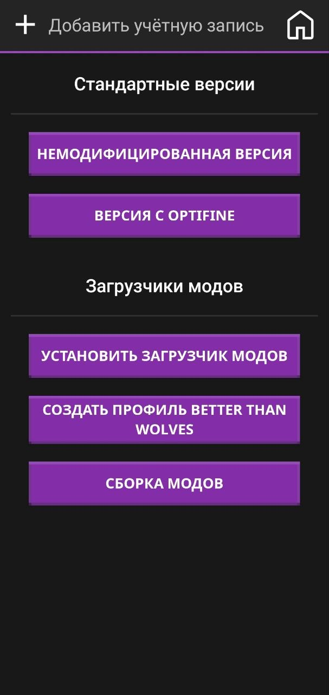
    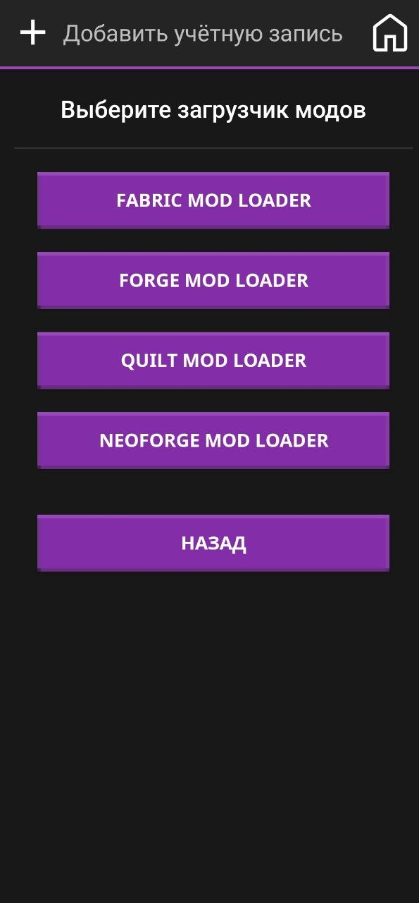
    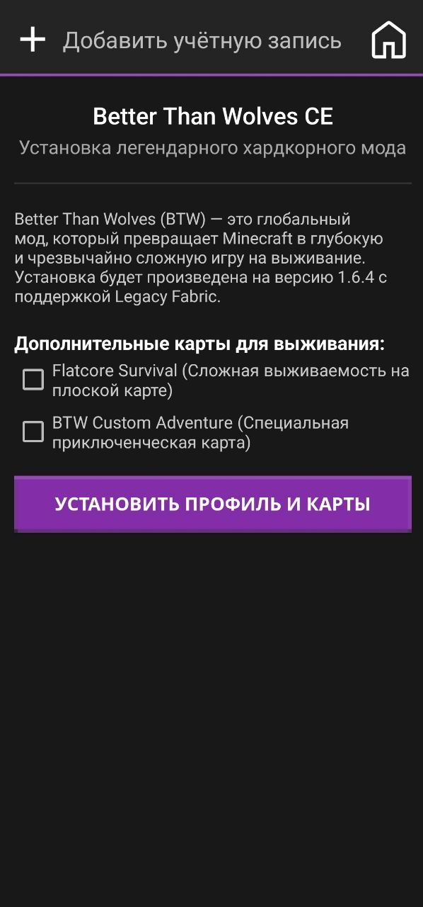
  </p>

- **Кастомные курсоры и встроенный пиксельный редактор**:
  - **Движок анимированных курсоров (`.ani`)**: нативное декодирование файлов анимированных курсоров Windows с помощью собственного бинарного парсера RIFF ACON.
  - **Реалтайм-рендеринг анимации**: оптимизированные хуки жизненного цикла и коллбеки Android-вью для плавной отрисовки курсора со скоростью 60 FPS на карточках настроек, тачпаде для тестирования и виртуальной мыши прямо в игре.
  - **Импорт кастомных курсоров**: прямая загрузка и применение любых файлов в форматах `.png`, `.cur` и `.ani`.
  - **Встроенный пиксельный редактор**:
    - **Подложка**: классическая сетка прозрачности «шахматная доска» в стиле Photoshop.
    - **Волшебное ведро (BFS заливка-ластик)**: автоматический «умный» ластик связной области цвета на базе поиска в ширину (BFS) с регулируемым порогом чувствительности (позволяет чисто вырезать белый или цветной фон PNG-картинок, не оставляя черных артефактов).
    - **Ручной ластик**: инструмент для точечного стирания пикселей с удобным ползунком радиуса кисти.
    - **История изменений**: глубокий стек Undo (до 10 действий) для легкого шага назад с кнопкой «Вернуть».
    - **Эргономика**: умная блокировка поворота экрана при редактировании, защищающая от случайной смены ориентации устройства.

  <p align="center">
    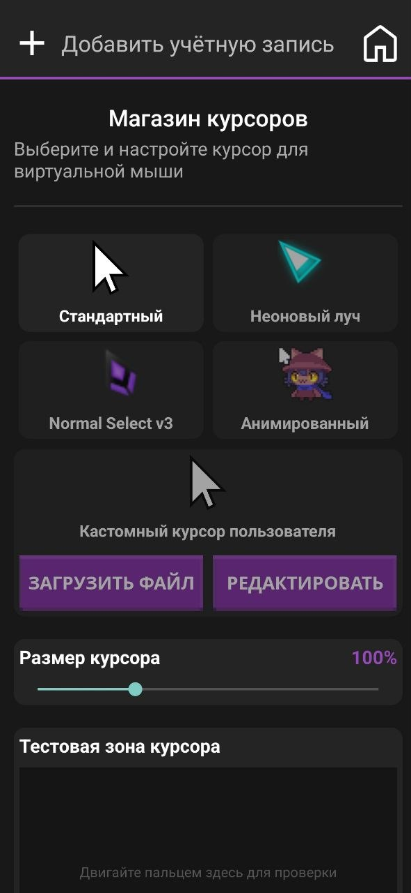
  </p>

- Автоподбор и установка нужной Java runtime перед запуском.
- Исправления для legacy Java 8/Java 17+/Java 21 runtime.
- Мгновенная параллельная загрузка списка версий OptiFine с устранением задержек DNS, fallback через зеркало и правильной сортировкой (без дополнительных действий со стороны пользователя).
- Уменьшенный APK: оставлены только `arm64-v8a` и `armeabi-v7a`, без x86/x86_64.
- Кастомное название, иконки и дефолтная иконка профиля XDAetherium.
- Настройка принудительного русского языка.
- **Продвинутое кастомное управление и кастомизация фона**:
  - **Цветовые палитры и цвет текста**: временно убрана возможность ставить картинку на фон (будет переработано), теперь вместо неё доступна удобная настройка сплошных цветов фона и цвета текста интерфейса.
  - **Кастомные текстуры и изображения для кнопок**: простая загрузка и привязка собственных картинок/иконок к виртуальным кнопкам управления для создания полностью уникального игрового интерфейса (HUD).
  - **Эргономичный размер кнопок**: оптимизированный и упрощенный процесс масштабирования и регулировки размеров кнопок для максимального удобства нажатия и точной настройки под размер экрана мобильного устройства.
  - **Дополнительные действия кнопок**: встроенная поддержка специальных действий, таких как «Отменить» и «Выйти».

  <p align="center">
    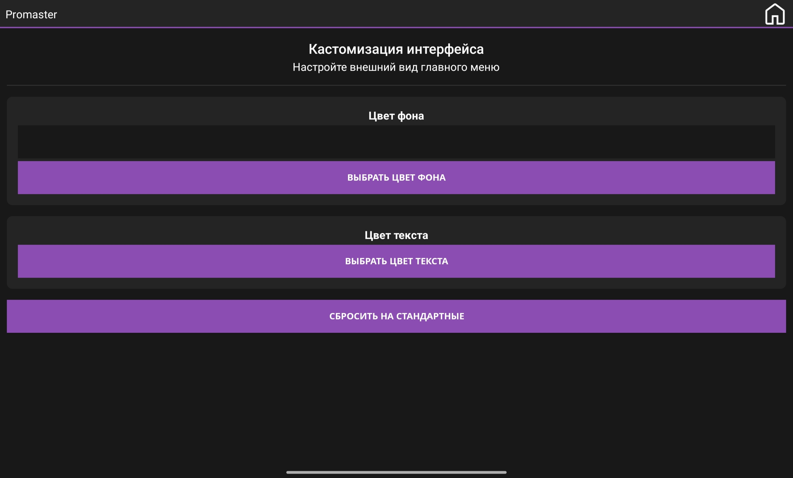
  </p>

  <p align="center">
    
    
  </p>

- **Глобальные исправления и система профилей**:
  - **Полная изоляция профилей (как в Modrinth App)**: каждый профиль теперь строго хранится в собственной изолированной папке (`profiles/Имя_Профиля`). Миры, моды и настройки больше никогда не перемешаются!
  - **Умное авто-именование**: при скачивании нескольких загрузчиков (например, OptiFine) лаунчер автоматически использует точное название версии или добавляет уникальные номера к папкам, чтобы избежать конфликтов.
  - **Исправление вылетов старых версий**: лаунчер теперь умеет автоматически сбрасывать "сломанные" текстовые бинды кнопок мыши (`key.mouse.middle`), которые крашили Minecraft 1.12.2 и ниже, ожидающие числовых кодов (например, `-100`).
  - **Защита от повреждённых скачиваний**: если архив с библиотеками скачался криво (моргнул интернет), лаунчер сам найдет битый файл, удалит его и предложит повторить загрузку, вместо краша игры.
  - **Интеграция фиксов**: перенесены исправления багов, аналогичные версии 1.1.5 Amethyst.
  - **Импорт/Экспорт профилей**: легко делитесь и бекапьте свои Minecraft-профили. Экспортируйте профиль в переносимый архив (включает версию, загрузчик модов и настройки) и импортируйте на любом устройстве с XDAetherium.

- **Принудительный язык Minecraft**:
  - Переопределите внутриигровой язык Minecraft независимо от языка системы.
  - Полный список ~140 поддерживаемых языков Minecraft с поиском и фильтрацией.
  - Лаунчер автоматически записывает выбранный язык в `options.txt` Minecraft перед каждым запуском.

  <p align="center">
    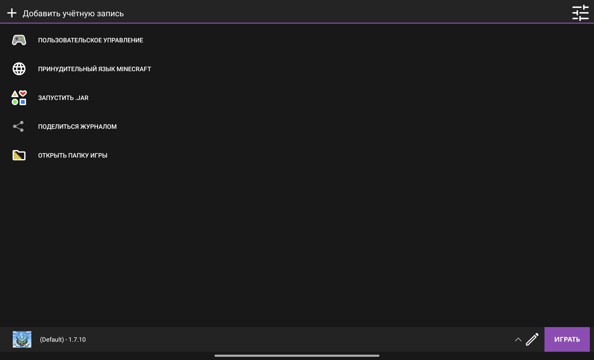
    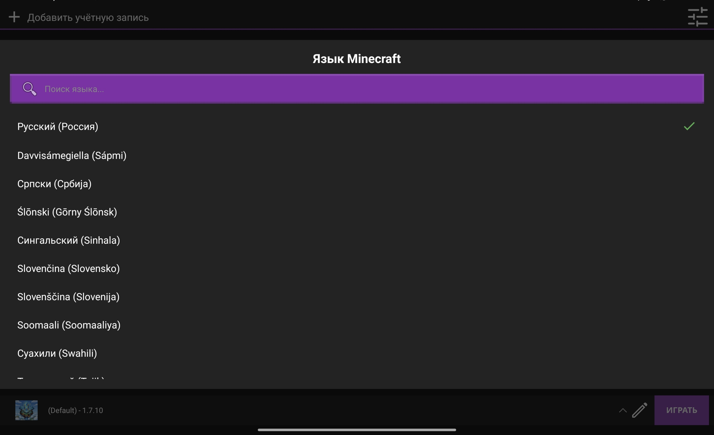
  </p>

- Отмена загрузок долгим нажатием на строку/прогресс загрузки.
- Убраны лишние ссылки upstream-проекта на wiki/Discord автора.

- **Ярлыки профилей на рабочем столе**:
  - Создай ярлык профиля прямо из **Редактора профиля**, нажав кнопку **«Создать ярлык»**.
  - Ярлык автоматически выбирает нужный профиль и запускает игру — никакой ручной навигации.
  - Иконка ярлыка берётся из текущей иконки профиля (включая кастомные из `assets/icons/`).

  <p align="center">
    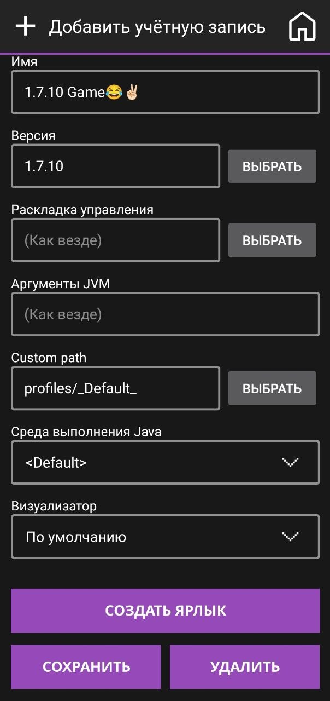
    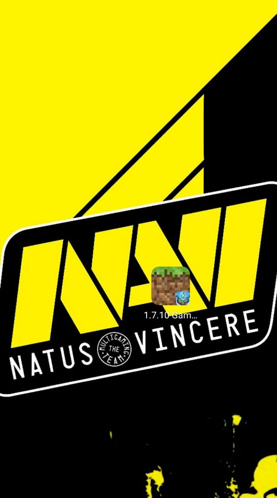
  </p>

- **Кастомные иконки профилей**:
  - Нажми на иконку профиля в **Редакторе профиля** — откроется меню выбора источника иконки.
  - **Выбрать из заготовок**: встроенные пресеты (`default`, `fabric`, `quilt`) **и** любые изображения из `assets/icons/` (`.webp` / `.png`).
  - **Выбрать своё изображение**: обрезка любого изображения с устройства как иконка профиля.
  - **Сбросить до стандартного**: возврат к дефолтной иконке.
  - Профиль BTW автоматически получает иконку `BTW.webp`.
  - Изменения применяются только при нажатии **Сохранить**.

  <p align="center">
    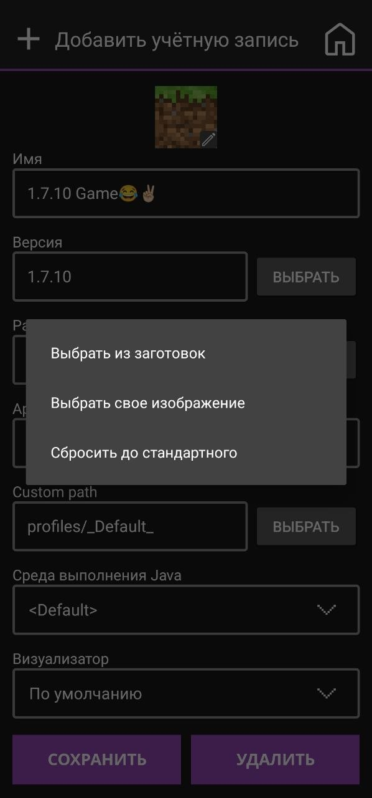
    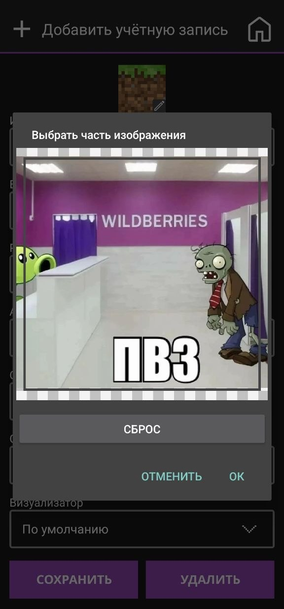
  </p>

## Статус сборки

Текущая локальная debug-сборка проверялась на устройстве Android 12:

- package debug: `org.angelauramc.amethyst.debug`
- versionName: `3.1.1`
- APK debug: около `82 MB`
- ABI: `arm64-v8a`, `armeabi-v7a`
- x86/x86_64 в APK отсутствуют

## Сборка из исходников

### Требования

- JDK, совместимый с Android Gradle Plugin проекта.
- Android SDK.
- Android NDK `27.3.13750724` или совместимый установленный NDK.
- Интернет для загрузки Gradle-зависимостей и игровых файлов.

### Windows

```bat
gradlew.bat :app_pojavlauncher:assembleDebug --console=plain
```

### Linux/macOS

```bash
./gradlew :app_pojavlauncher:assembleDebug --console=plain
```

Готовый debug APK появится здесь:

```text
app_pojavlauncher/build/outputs/apk/debug/app_pojavlauncher-debug.apk
```

Release-сборка:

```bash
./gradlew :app_pojavlauncher:assembleRelease --console=plain
```

На Windows используйте `gradlew.bat` вместо `./gradlew`.

## Установка debug APK

```bash
adb install -r app_pojavlauncher/build/outputs/apk/debug/app_pojavlauncher-debug.apk
```

Для конкретного устройства:

```bash
adb -s <device_id> install -r app_pojavlauncher/build/outputs/apk/debug/app_pojavlauncher-debug.apk
```

## Ely.by

В XDAetherium добавлен отдельный способ авторизации **Ely.by Account**.

Как это работает:

1. Лаунчер авторизуется через Ely.by Yggdrasil API.
2. Аккаунт сохраняется как обычный Minecraft-профиль лаунчера.
3. При запуске игры для Ely.by-аккаунта добавляется `authlib-injector` как Java-agent.
4. Minecraft получает session/profile/textures через Ely.by, поэтому скин виден в игре.
5. Для главного меню лаунчер отдельно скачивает PNG скина Ely.by, вырезает лицо и overlay-шлем, затем кеширует голову профиля.

Если скин в меню не обновился сразу, перезапустите лаунчер или заново выберите Ely.by-аккаунт.

## Оптимизация APK

Сборка настроена под ARM-устройства:

```gradle
abiFilters "arm64-v8a", "armeabi-v7a"
```

Это уменьшает APK и убирает ненужные x86/x86_64 библиотеки. Если нужна поддержка x86/x86_64, ABI-фильтры и assets LWJGL нужно возвращать отдельно.

## Перед публикацией на GitHub

Перед тем как делать публичный репозиторий:

- Не публикуйте signing credentials и пароли keystore. Вынесите их из Gradle-конфига в переменные окружения, `local.properties` или другой локальный файл, который находится в `.gitignore`.
- Не коммитьте `local.properties`, build-логи, временные APK и личные файлы.
- Оставьте исходный `LICENSE` и этот README.
- Укажите, что проект является fork/модификацией Amethyst/PojavLauncher/Boardwalk.
- Если выкладываете APK-релиз, выкладывайте соответствующий исходный код этой же версии.

## Лицензия

Основной проект распространяется по лицензии **GNU LGPLv3** — см. файл [LICENSE](LICENSE).

В проекте также используются компоненты с другими свободными лицензиями. В частности, добавленный `authlib-injector` распространяется по **GNU AGPLv3** и включён как отдельный Java-agent-компонент.

## Credits

Проект основан на работе следующих проектов и библиотек:

- [Amethyst Android](https://github.com/AngelAuraMC/Amethyst-Android)
- [PojavLauncher](https://github.com/PojavLauncherTeam/PojavLauncher)
- [Boardwalk](https://github.com/zhuowei/Boardwalk)
- [authlib-injector](https://github.com/yushijinhun/authlib-injector)
- [Ely.by](https://ely.by/) API и skin system
- LWJGL, OpenJDK, SDL, GL4ES, MobileGlues, Mesa и другие зависимости, используемые upstream-проектом

Спасибо всем авторам upstream-проектов и библиотек.
